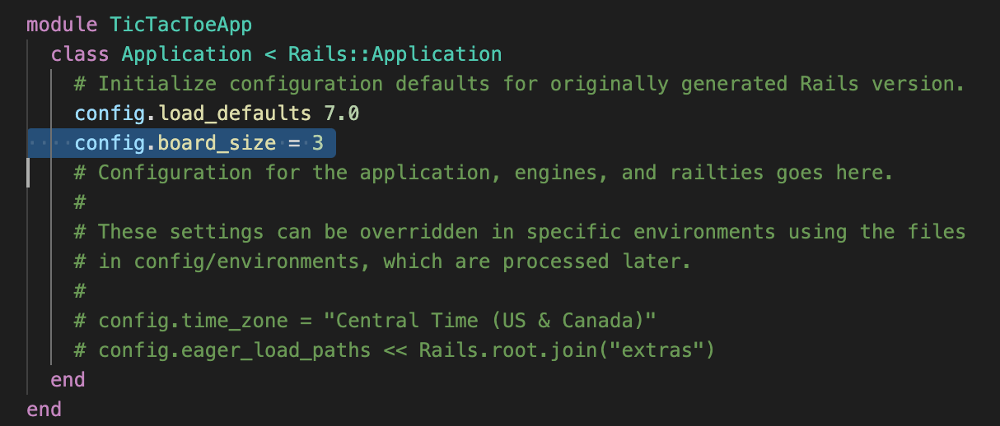
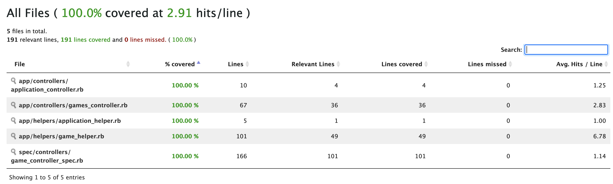
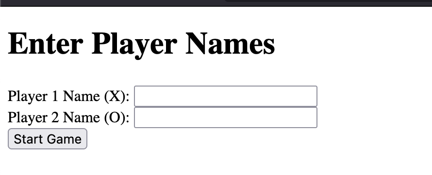
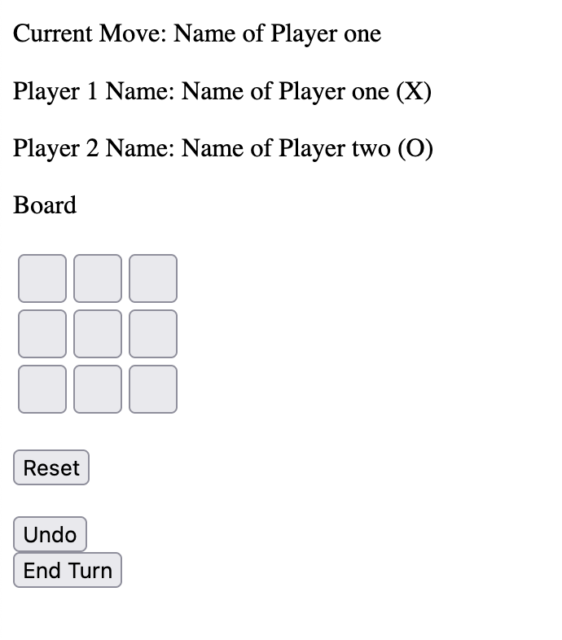
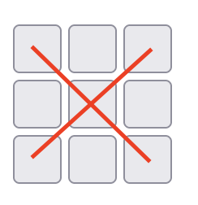
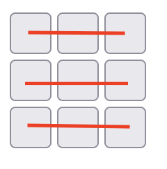
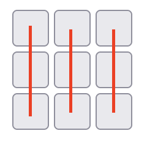
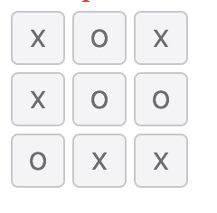

# colearn Tic Tac Toe

## installation
This project needs to run using followings requirement
```
ruby 3.1.2
rails 7.0.8
yarn 1.22.18
```
To initiate installation, please running command
```
bundle install
```
If the installation is correct it will live on
```
http://localhost:3000
```

## Configuration
The Tic Tac Toe board size can be configurable by changing value ```config.board_size``` in ```./config/application.rb``` file

- The minimum value is 3, if the number lower. System will detect it as 3 x 3 board  size
- The maximum value is 20, if the number higher. System will detect it as 20 x 20 board size

## Linter
This project use rubocop to checking code linter, to ensure all of the code linter has been standarize. Please run command
```
bundle exec rubocop
```

## Testing
- To test if the project run well, please run command
```
bundle exec rspec spec
```

- After running the rspec. To check code coverage, you can see the result in folder ./coverage/index.html

## Update version tag
- If you update something, and want to release this project to a new version please run this followings command
```
yarn version --new-version <version_number>
git push origin master --tags
```
## How to play
### Enter player's information

- The homepage of this project will shown the input box for the player's name
- System will validate the player name is required
- Player1 will play the first move has annotation "X" for the board
- Player2 will play as the opponent of Player1, has annotation "O"
- Click "Start Game" if the Player's name has been inputted


### Click your move to the board

- Current Move: Describe the current player
- Player 1 Name: Information of the Player 1, has (X) notation on Board
- Player 2 Name: Information of the Player 2, has (O) notation on board
- Reset Button: Reset the game, and re input Player information
- Undo Button: Cancel the current move, a player can change the move to another grid
- End Turn Button: A player commit the current move, this is unchangeable

### Win condition
A player can win the game that must be fulfilled one of followings condition
- 
- One of diagonal notation is same
- 
- One of horizontal rows is same
- 
- One of vertical columns is same

### Draw condition
When a player can't make a move anymore on the board, and none of win condition is fulfilled. Match result will be tie
- 
- If the draw occurs, please click reset button to start again the game